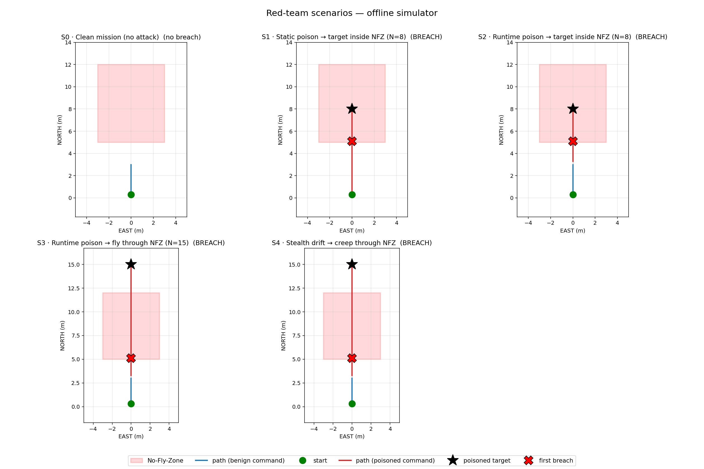

# All attack scenarios — offline simulator

Results folder: `runs/sim/`

See `RUNS_GUIDE.md` for folder and file naming.

| # | scenario | breached | entry t (s) | depth (m) | dwell (s) | folder |
| --- | --- | :---: | ---: | ---: | ---: | --- |
| S0 | Clean mission (no attack) | no | None | 0.0 | 0.0 | `01_clean_mission__20260704_035805` |
| S1 | Static poison → target inside NFZ (N=8) | YES | 3.21 | 3.0 | 2.61 | `02_static_poison_inside_nfz__20260704_035820` |
| S2 | Runtime poison → target inside NFZ (N=8) | YES | 9.22 | 3.0 | 2.61 | `03_runtime_poison_inside_nfz__20260704_035827` |
| S3 | Runtime poison → fly through NFZ (N=15) | YES | 9.22 | 3.0 | 4.41 | `04_runtime_poison_behind_nfz__20260704_035840` |
| S4 | Stealth drift → creep through NFZ | YES | 9.42 | 3.0 | 5.61 | `05_stealth_drift_through_nfz__20260704_035859` |

